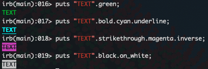
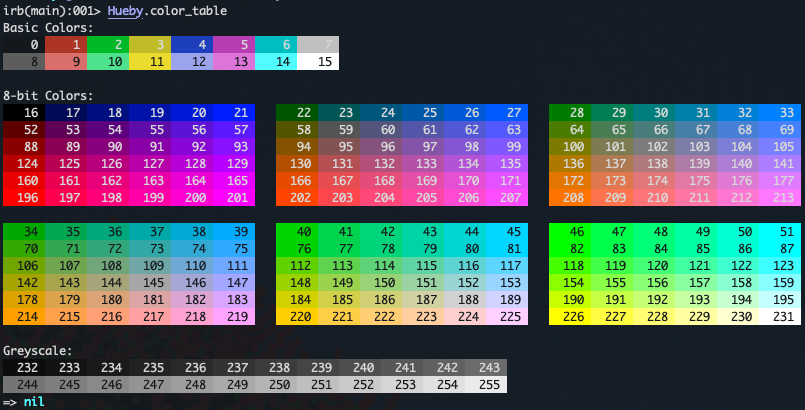
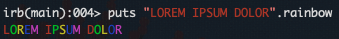
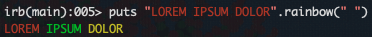

# Hueby

**Hueby** is a Ruby library to allow for easy styling of text in the console.

I intend to make this into a Ruby Gem.

## Usage

```ruby
require "hueby"

String.include CoreExtensions::String::Hueby
```

After this, the String class will now include new methods to style your strings.

## Features

### Change text style

```ruby
 :bold,
 :dim,
 :italic,
 :underline,
 :inverse,
 :invisible,
 :strikethrough,
```

### Change text color
```ruby
 :black,
 :red,
 :green,
 :yellow,
 :blue,
 :magenta,
 :cyan,
 :white,
 :bright_black,
 :bright_red,
 :bright_green,
 :bright_yellow,
 :bright_blue,
 :bright_magenta,
 :bright_cyan,
 :bright_white
```

### Change background color
```ruby
 :on_black,
 :on_red,
 :on_green,
 :on_yellow,
 :on_blue,
 :on_magenta,
 :on_cyan,
 :on_white,
 :on_bright_black,
 :on_bright_red,
 :on_bright_green,
 :on_bright_yellow,
 :on_bright_blue,
 :on_bright_magenta,
 :on_bright_cyan,
 :on_bright_white,
```

### Remove any applied styles (NOT YET IMPLEMENTED)
```ruby
 :default
```

All methods return the altered string and are, therefore, chainable. The original string value will not be modified.



## More flexibility with the `#in` and `#on` methods

The `in` method on a string instance can be used to change the text color or style.

Styles can be specified in the following ways:

- As a string or symbol

```ruby
"TEXT".in("red")
"TEXT".in(:blue)
"TEXT".in("bold")
"TEXT".in(:strikethrough)
```

- As an array of integers representing red, green and blue integer values.

```ruby
"TEXT".in([52, 144, 6])
```

- As a single integer between 0 and 255 which represents an 8-bit color.
```ruby
"TEXT".in(0)
"TEXT".in(13)
"TEXT".in(208)
```

_These colors can be previewed using `Hueby.color_table`_



- As a string representing a hex color

```ruby
"TEXT".in("#F29C0A")
```

`in` accepts any number of arguments at once. The later arguments will overwrite the earlier if they conflict.

```ruby
"TEXT".in("red", :bold)
"TEXT".in(199, "italic")
"TEXT".in("forrestgreen", "italic")
"TEXT".in([15, 199, 80], :underline)
```

The `on` method works similarly to `in` and can be used to style the background of a string. However, it accepts only a single argument and will error when sent invalid styles such as `"italic"` or `:bold` as those do not apply to background styles.

```ruby
"TEXT".on("red")
"TEXT".on([55, 199, 20])
"TEXT".on(99)
"TEXT".on("#F29C0A")
"TEXT".on(:bold)
=> `colorize_with_string': Unrecognized style: 'bold' (ArgumentError)
```

## Library of colors

Hueby comes with a library of the same 140 [named colors](https://developer.mozilla.org/en-US/docs/Web/CSS/named-color) available in all web browsers.

These are all available as both foreground and background methods on String instances as well as by those names for use with `in` and `on`. See the [Full list of colors](lib/named_colors.csv).

```ruby
"TEXT".forestgreen
"TEXT".on_orange
"TEXT".in(:olive)
"TEXT".on("powderblue")
```

## Your Own Custom Named Colors

If Hueby doesn't have the color you want you can define your own!

`Hueby.define_color` can be used to do this.

```ruby
# Define colors in the same 3 ways that others can be referenced: Hex, Integer 256 and RGB Array
Hueby.define_color("my_own_hex_color", "#FF09AC")
Hueby.define_color("my_own_int_color", 99)
Hueby.define_color("my_own_rgb_color", [81, 155, 10])
```

By default these will only be referencable using `in` or `on`. To have methods created for them, pass `create_methods: true`

```ruby
Hueby.define_color("my_own_hex_color", "#FF09AC")
"".my_own_hex_color
# => (irb):8:in `<main>': undefined method 'my_own_hex_color' for an instance of String (NoMethodError)`

# `define_color` will return a list of the methods created
methods = Hueby.define_color("my_own_hex_color", "#FF09AC", create_methods: true)
=> [:my_own_hex_color, :on_my_own_hex_color]

# define_color will raise an error if it would overwrite an existing method not defined by Hueby
Hueby.define_color("split", 99, create_methods: true)
# => Cannot define color method "split" as that would overwrite an existing method. (ArgumentError)
```

## Other Methods

The `rainbow` method will colorize each character in a string with a different one of the 6 base colors aside from white and black.



It also accepts an argument to split the string on and will apply the coloring to each part.



# Future Improvements

- [ ] Make into a Gem
- [ ] Display list of all defined colors
- [ ] Method for finding contrasting color
